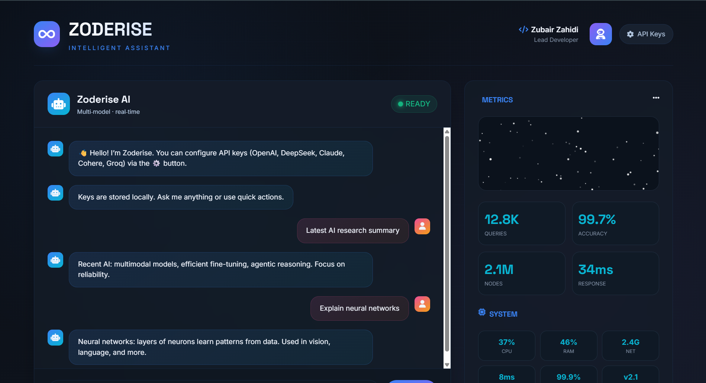
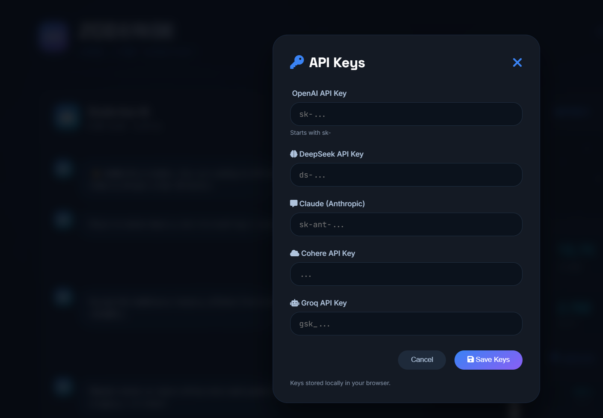

# 🚀 Chatbot UI with API Key Integration



## 📖 Overview
This project is a **modern HTML/CSS/JS chatbot interface** that allows users to connect their own API keys (e.g., OpenAI) and interact directly with AI models. It’s designed as a sleek, portfolio‑ready demo showcasing both **UI creativity** and **API integration skills**.



## ✨ Features
- 🔑 **API Key Modal** – Secure input for user‑provided keys
- 💬 **Interactive Chat Window** – User and bot messages styled with futuristic bubbles
- 🎨 **Cosmic Background & Grid Overlay** – Eye‑catching design for a professional portfolio
- 🌓 **Dark/Light Mode Toggle** (optional enhancement)
- 🗂 **Local Chat History** – Stored in `localStorage` for persistence
- 🧹 **Clear Chat Button** – Reset conversations instantly

## 🛠️ Tech Stack
- **HTML5** – Structure
- **CSS3** – Styling (cosmic theme, grid overlay, chat bubbles)
- **JavaScript (ES6)** – API integration and dynamic chat logic
- **Font Awesome** – Icons for modal and UI elements

## ⚡ Getting Started
1. Clone the repository:
   ```bash
   git clone https://github.com/Zubair-zahidi/chatbot-ui.git
   cd chatbot-ui
